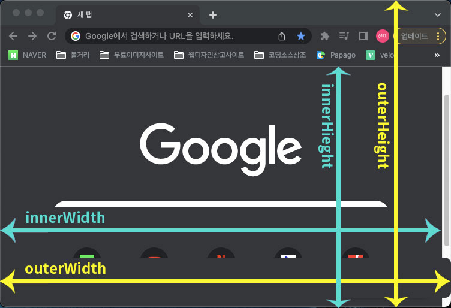

# 3D Animation


### css 관련정보와 설명

```css
.card {
  transform-style: preserve-3d;
  -webkit-transform-style: preserve-3d;
  transition: all 0.3s ease;
  -webkit-transition: all 0.3s ease;
}
```

- `-webkit`:CSS의 접두어. CSS의 속성들이 모든 브라우저에서 호환이 되는것은 아니기 때문에위와같이 (-webkit-)과 같은 CSS 접두어를 붙여 모든 브라우저에서 똑같은 동작을 하도록 표준화 시켜주는 것이다.

|  접두어  |          내용          |
| :------: | :--------------------: |
| -webkit- | Safari,Chrome, Android |
|  -moz-   |        FireFox         |
|   -o-    |         Opera          |

```css
.circle {
  width: 15rem;
  height: 15rem;
}
```

- `rem`:문서의 최상위 요소를 기준으로하며 즉,html 요소의 크기의 몇 배인지로 크기를 정한다.
- `em`:상위 요소 크기의 몇 배인지로 크기를 정한다.

### js 관련정보와 설명

```js
container.addEventListener("mousemove", (event) => {
  console.log(event.pageX, event.pageY);
  let xAxis = (window.innerWidth / 2 - event.pageX) / 20;
  let yAxis = (window.innerHeight / 2 - event.pageY) / 20;

  card.style.transform = `rotateY(${yAxis}deg) rotateX(${xAxis}deg)`;
});
```

- `innerWidth` :브라우저 화면의 너비
- `innerHeight` :브라우저 화면의 높이
- `outerWidth` :브라우저 전체의 너비
- `outerHeight` :브라우저 전체의 높이

이미지참고


- `pageX`와 `pageY` : 브라우저의 왼쪽 맨위(inner기준) 을 기점으로 x축, y축으로 마우스이벤트가 발생한 값을 반환.

`let xAxis = (window.innerWidth/2 - e.pageX)/20;`
이라는 구문의 의미는 xAxis 라는 이름의 변수를 정의할건데, 그 변수의 값은 브라우저 innerWidth를 절반으로 나눈 값에서 마우스가 x축으로 이벤트 발생한 값 만큼을 뺀 뒤, 거기서 20을 나눈 값이야 라고 해석 가능함. (마지막에 나누는 값이 작아질 수록 결과값은 커질 것이기 때문에 마우스의 움직임에 따라 반응하는 범위도 넓어짐.)

`${xAxis}, ${yAxis}` 는 let으로 정의한 xAxis와 yAxis의 값을 불러옴을 의미한다. css를 javascript를 이용해 가변적으로 작성한것

```js
//Animate in
container.addEventListener("mouseenter", (event) => {
  card.style.transition = "none";

  //Popout (튀어나오다.)
  item.style.transform = "translateZ(150px) rotateZ(-35deg)";
  title.style.transform = "translateZ(125px)";
  description.style.transform = "translateZ(100px)";
  options.style.transform = "translateZ(100px)";
  purchase.style.transform = "translateZ(75px)";
});
```

- `translateZ` :입체적인 z축을 의미한다.

```js
container.addEventListener("mouseleave", (event) => {
  card.style.transition = "all .3s ease";
  card.style.transform = `rotateY(0deg) rotateX(0deg)`;
});
```

마우스가 이미지를 벗어났을때 다시 원래대로 돌리기 위해 전체적인 값을 0로 설정한것이다.
